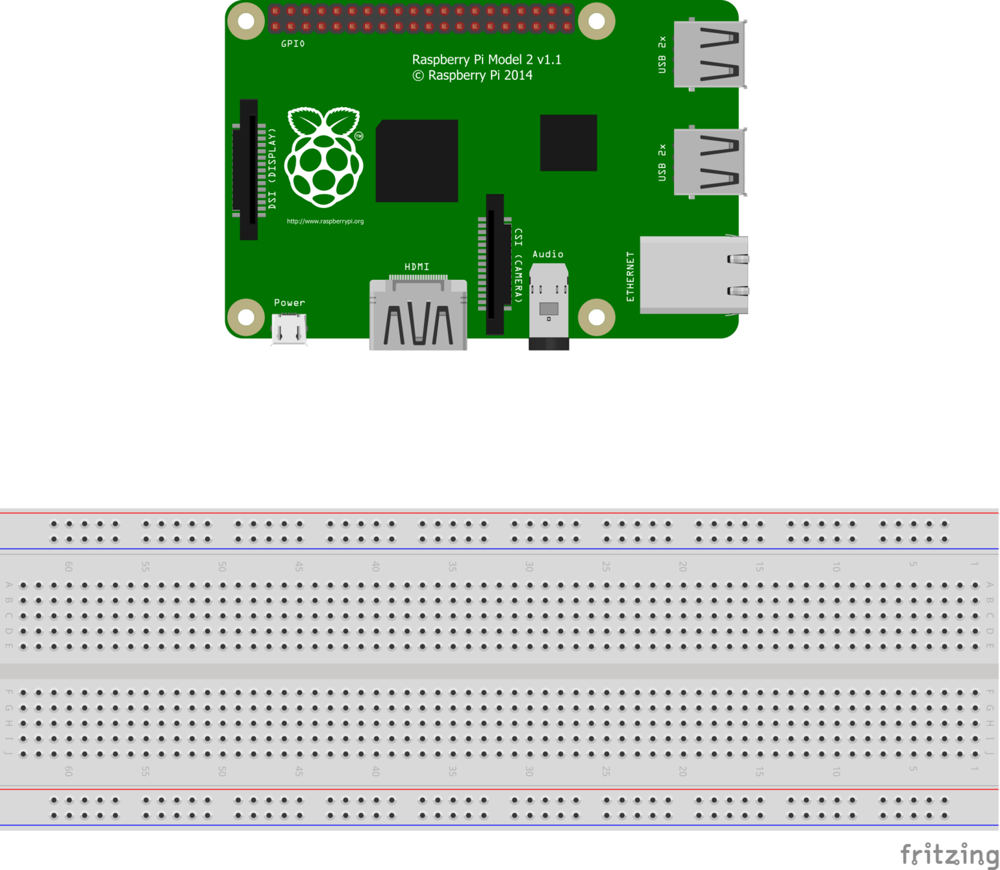
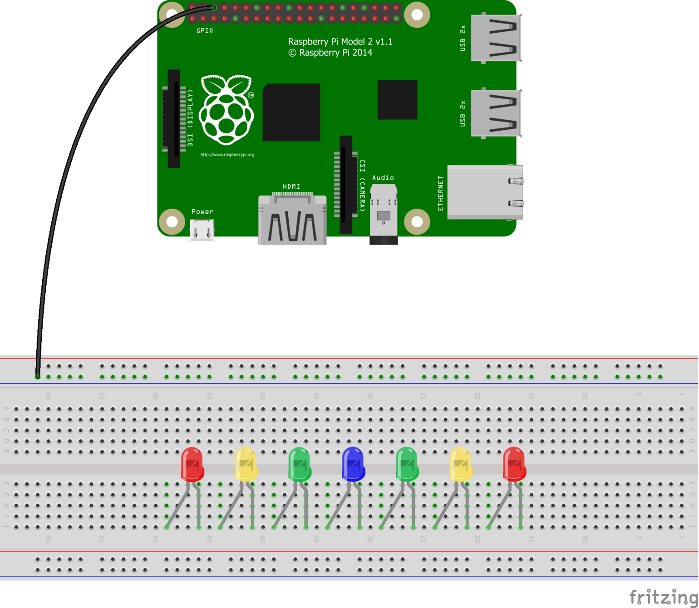
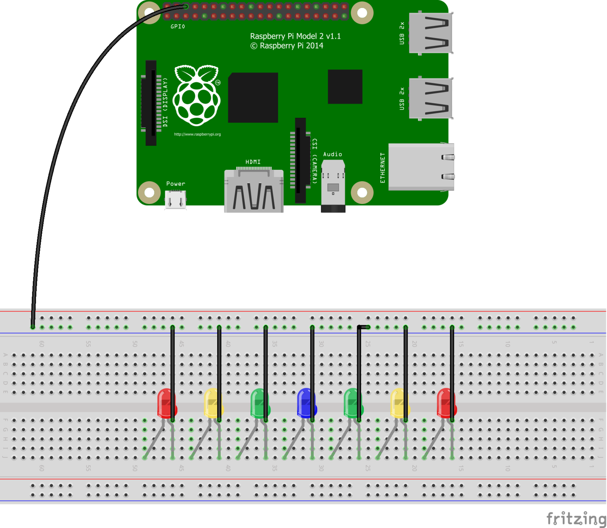
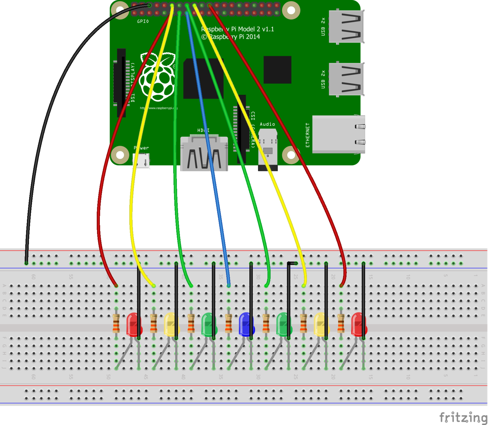
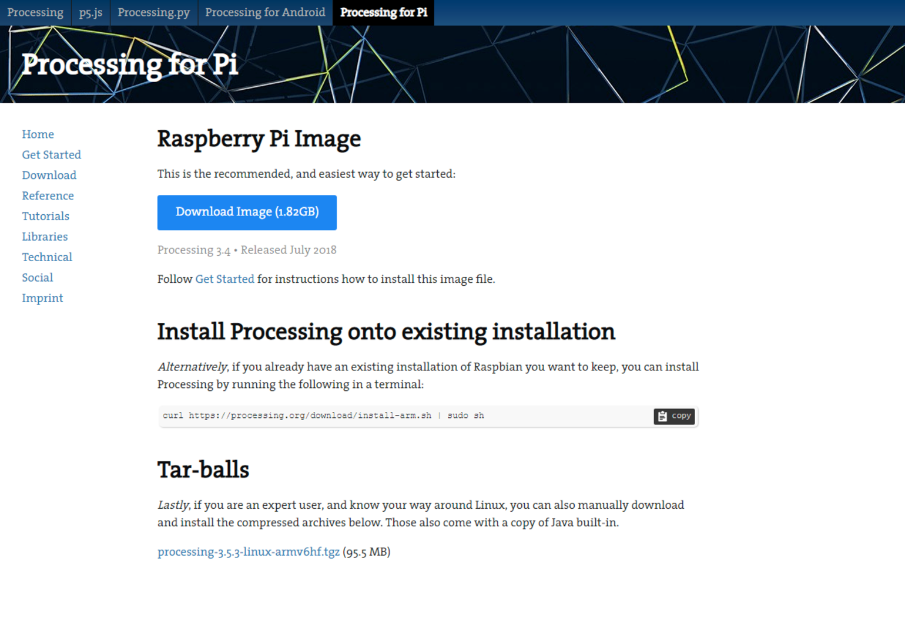
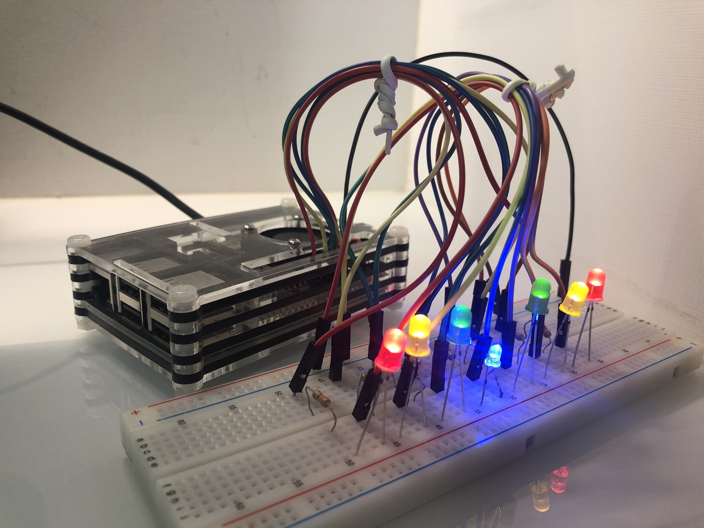
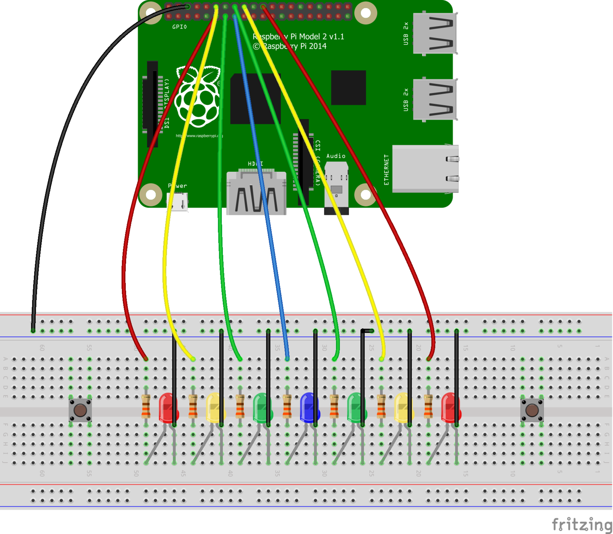
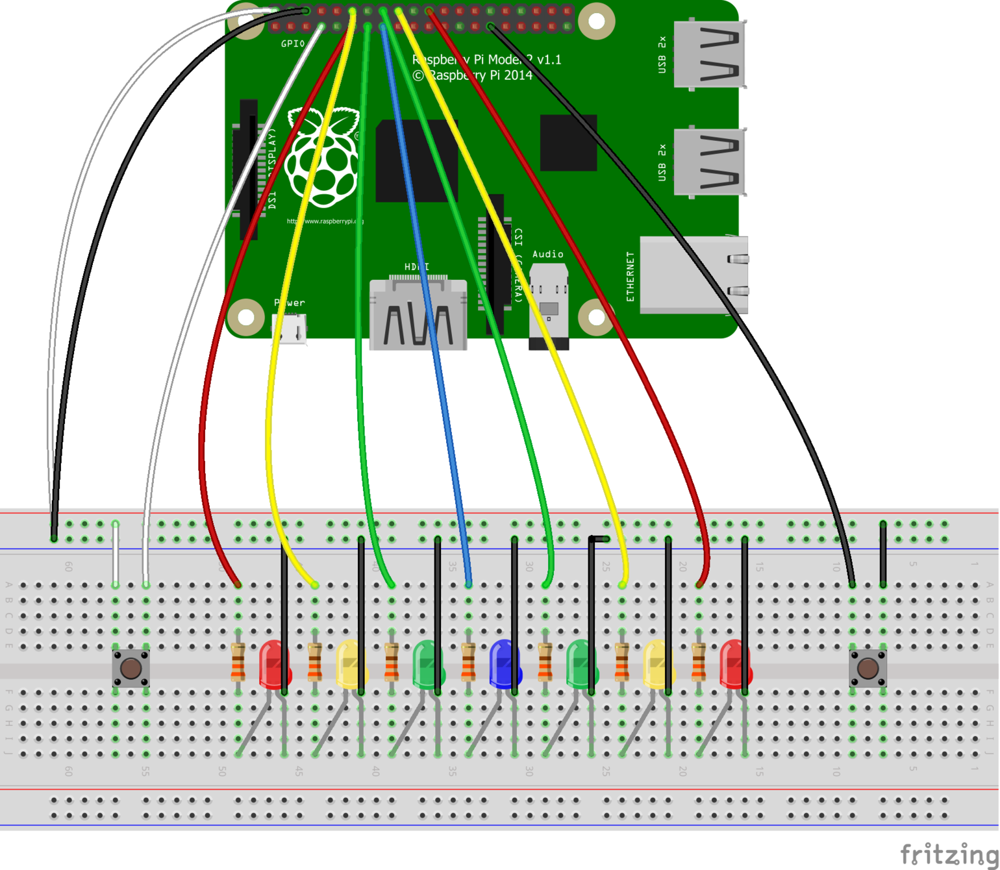
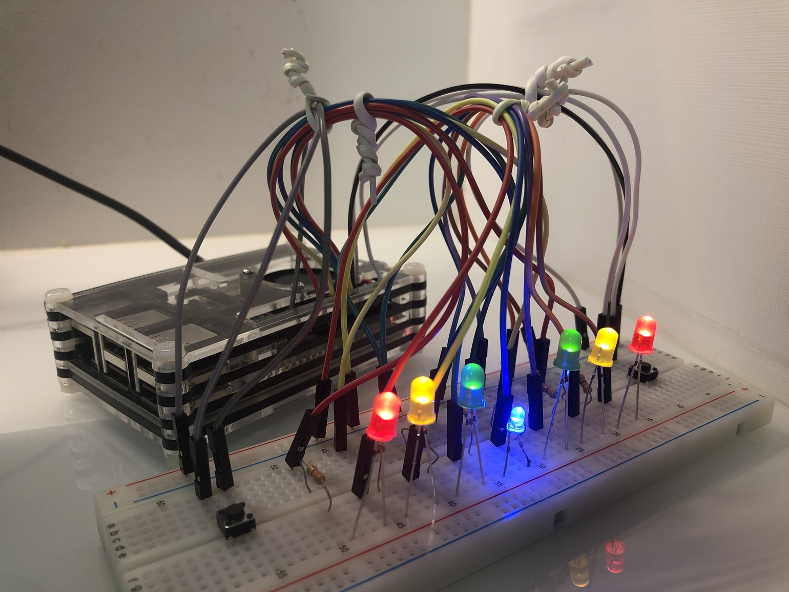

### Índice
* [O jogo](#game)
* [Como jogar](#playit)
* [O que você vai precisar](#materials)
* [Como montar](#buildit)

### O jogo
Bop-It! Pi é um jogo feito para o [Raspberry Pi](https://www.raspberrypi.org/), programado em [Processing]() e que faz uso dos pinos [GPIO (General Purpose Input and Output)](https://pt.wikipedia.org/wiki/General_Purpose_Input/Output) da placa. Ele foi inpirado no [Bop It! Smash](https://en.wikipedia.org/wiki/Bop_It#Bop-It!_Smash), um brinquedo feito pela [Hasbro](https://pt.wikipedia.org/wiki/Hasbro).

### Como jogar
O jogo consiste em conseguir a melhor pontuação que você puder sem perder nenhuma vida ao fazê-lo. Os LEDs irão piscar como uma bola quicando de um lado para o outro. Você deve pressionar duas teclas simultaneamente em seu teclado para pegá-la. Os LEDs vermelhos e amarelos te fazem perder um coração, enquanto o LED azul (o do centro) te faz recuperar um (a não ser que você esteja com todos os 3). A pontuação que você consegue a cada rodada também depende do LED onde a "bola" para. Ideias para uma nova mecânica de jogo? Dúvidas? Me mostre-as [aqui](https://github.com/joogps/Bop-It-Pi/issues)!

### O que você vai precisar:
- Um Raspberry Pi de qualquer modelo (o mostrado no tutorial será o Raspberry Pi Model 2 v1.1);
- Uma protoboard com dois lados*;
- 2 LEDs vermelhos**;
- 2 LEDs amarelos**;
- 2 LEDs verdes**;
- 1 LED azul**;
- 7 resistores de 330ohm;
- 11 cabos jumper macho/fêmea (3 deles são opcionais);
- 9 cabos jumper macho/macho (2 deles são opcionais);
- O código em Processing disponível [aqui](https://github.com/joogps/Bop-It-Pi/tree/master/Game);
- 2 push buttons (opcional)

__\*__ Você pode, sim, montar o circuito em uma placa com apenas um lado, mas a explicação será baseada em uma de dois.  
__\*\*__ Os LEDs não precisam, necessariamente, ser vermelhos, verdes, amarelos e azuis. A única coisa que importa é se você os organiza corretamente. Você ainda pode editar o código para adiconar mais LEDs, remvover alguns se você não tem o suficiente ou até talvez editar as suas conexões com a interface GPIO.

### Como montar:
_Imagens de circuito feitas com o [Fritzing](http://fritzing.org/home/). Você pode clicá-las para vê-las em tela cheia ou ver todos os arquivos de tutorial [aqui](https://github.com/joogps/Bop-It-Pi/tree/master/Circuit)._

<table>
	<tr> <td> <b>1.</b> Se certifique de que o seu Raspberry Pi está funcionando, desligue-o e pegue a sua protoboard. </td> <td><a href="../Circuit/Main/Step1.png"></img></a> </td> </tr>
	<tr> <td> <b>2.</b> Simetricamente posicionar os LEDs na parte inferior de sua protoboard com as 'pernas' de anodo (as mais curtas) em sua direita </td> <td><a href="../Circuit/Main/Step2.png"></img></a> </td> </tr>
	<tr> <td> <b>3.</b> Usando um cabo jumper macho-fêmea, faça uma conexão entre qualquer pino terra (GND) em seu Raspberry Pi e a coluna negativa (azul) na protoboard. </td> <td><a href="../Circuit/Main/Step3.png"></img></a> </td> </tr>
	<tr> <td> <b>4.</b> Use cabos macho-macho para conectar as 'pernas' de anodo (as da direita) dos LEDs com a coluna negativa de sue Protoboard. </td> <td><a href="../Circuit/Main/Step4.png"></img></a> </td> </tr>
	<tr> <td> <b>5.</b> Use todos os 7 resistores para conectar as pernas de catodo (as da direita) dos LEDs com algum buraco da linha acima da qual o catodo de seu LED está posicionado em sua protoboard. </td> <td><a href="../Circuit/Main/Step5.png"></img></a> </td> </tr>
	<tr> <td> <b>6.</b> Conecte os resistores ao seu Raspberry Pi nos seguintes pinos (vá do resistor da extrema esquerda para o da extrema direita): 
		<ul>
			<li>GPIO17 (pino 11)</li>
			<li>GPIO18 (pino 12)</li>
			<li>GPIO27 (pino 13)</li>
			<li>GPIO22 (pino 15)</li>
			<li>GPIO23 (pino 16)</li>
			<li>GPIO24 (pino 18)</li>
			<li>GPIO25 (pino 22)</li>
		</ul> </td> <td><a href="../Circuit/Main/Step6.png"></img></a> </td> </tr>
	<tr> <td> <b>7.</b> Assim que você tiver o código em Processing no seu computador, certfique-se de que você tem o <a href="https://pi.processing.org/download/">Processing for Pi instalado</a> e execute os arquivos do jogo. Caso você não queira editar o código provido pelo repositório posteriormente, você pode simplesmente executar a aplicação exportada disponível <a href="https://github.com/joogps/Bop-It-Pi/releases/tag/v1.0">aqui</a> sem ter que instalar o Processing em si. </td> <td><a href="../Circuit/Main/Step7.png"></img></a> </td> </tr>
	<tr> <td> <b>8.</b> Está pronto! Parabéns, você conseguiu! Espero que você aproveite muito! Sinta-se livre para <a href="https://github.com/joogps/Bop-It-Pi/issues/new">fazer perguntas ou reportar problemas</a> e me ajudar a desenvolver ainda mais esse projeto! Se você precisa de ajuda sobre a jogabilidade, visite a <a href="#playit">seção como jogar</a>! </td> <td> <a href="../Circuit/Main/Step8.jpg"></img></a> </td> </tr>
</table>

#### Colocando os botões (opcional)
Se você quiser, você pode usar botões ao invés de teclas para jogar o jogo.
Abaixo está um tutorial mostrando como colocá-los no seu circuito.

<table> 
	<tr> <td> <b>1.</b> Pegue o seu circuito e desligue o seu Raspberry Pi. </td> <td> <a href="../Circuit/Buttons/Step1.png"></img></a> </td> </tr>
	<tr> <td> <b>2.</b> Posicione os botões simetricamente em sua protoboard. Certifique-se de que eles atravessam a fronteira dos lados de sua placa. </td> <td> <a href="../Circuit/Buttons/Step2.png"></img></a> </td> </tr>
	<tr> <td> <b>3.</b> Usando um cabo jumper macho-fêmea, faça uma conexão entre qualquer pino 5V do seu Raspberry Pi e a coluna positiva (vermelha) da sua protoboard.</td> <td> <a href="../Circuit/Buttons/Step3.png"></img></a> </td> </tr>
	<tr> <td> <b>4.</b> Conecte uma das pernas de cada botão com a coluna positiva da protoboard usando cabos jumper macho-macho. </td> <td> <a href="../Circuit/Buttons/Step4.png"></img></a> </td> </tr>
	<tr> <td> <b>5.</b> Conecte a perna restante de cada botão no Raspberry Pi nos pinos respectivos:
		<ul>
			<li>GPIO4 (pino 7)</li>
			<li>GPIO5 (pino 29)</li>
		</ul> 
	</td> <td> <a href="../Circuit/Buttons/Step5.png"></img></a> </td> </tr>
	<tr> <td> <b>6.</b> Está pronto! Agora você pode jogar Bop-It-Pi tanto usando as teclas do seu teclado quanto os botões que você acabou de colocar! </td> <td> <a href="../Circuit/Buttons/Step6.jpg"></img></a> </td> </tr>
</table>

### [Back to top / Voltar ao início](#page)

