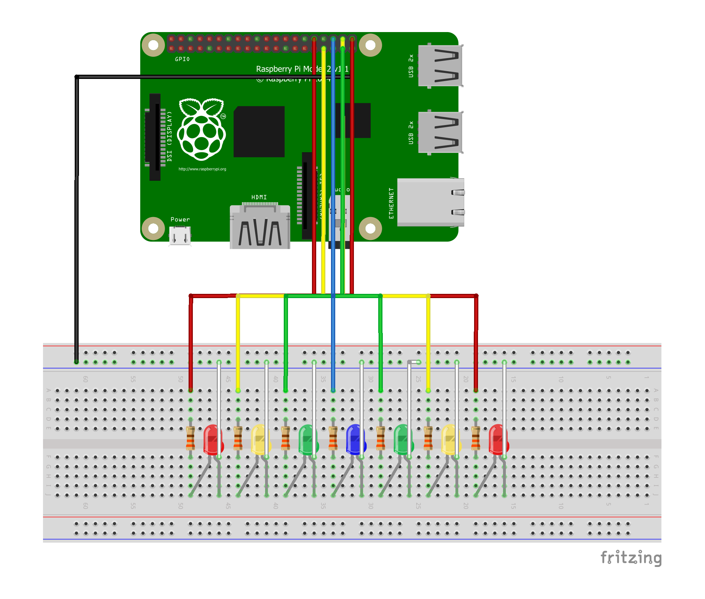

# Bop It! Pi
## [[en](#en)-[pt](#pt)]

## English

### The game
Bop It! Pi is a game made for the Raspberry Pi using the Processing programming language. it was inspired by [Bop It! Smash](https://en.wikipedia.org/wiki/Bop_It#Bop-It!_Smash), a toy made by Hasbro. The game consists on trying to get the greatest score you can without losing any life while doing it. The LEDs will flash like a bouncing ball. You need to press a key on your keyboard to catch it. The blue LED (the one in the center) recovers one heart, while the yellow and red LEDs make you lose one. The score you get for each catch also depends on the color of the "ball".

### What you will need: 
- A Raspberry Pi of any model
- A double-sided breadboard*
- 2 red LEDs**
- 2 yellow LEDs**
- 2 green LEDs**
- 1 blue LED**
- 7 330ohm resistors
- 15 jumper wires
- The Processing code available [here](https://github.com/joogps/Bop-It-Pi/tree/master/Game)

\*You can manage to do it in a single-sided breadboard on as well, but the explanation will be based on a double-sided one
\*\*The LEDs don't need to necessarily be red, green, yellow and blue. The only thing that matters is wether not you arrange them properly.

### How to build it:
| </img>
| :--: |
| *Made with [Fritzing](http://fritzing.org/home/)* - [view raw](https://github.com/joogps/Bop-It-Pi/blob/master/Circuit/Bop-It-Pi.fzz?raw=true)| 
| Use this image to guide you through the process of building the circuit | 

1. Simetrically place the LEDs on the right side of your breadboard.
2. Connect a cable from any ground pin on your Raspberry Pi to the negative line on your breadboard.
3. Use jumper wires to connect the anode legs (the shorter ones) of the LEDs to the negative line of the breadboard.
4. Use all of the 7 resistors to connect the cathode legs (the longer ones) of the LEDs to the left side of the breadboard.
5. Connect the resistors to your Raspberry Pi on the following order (go from the extreme left LED to the extreme right one): 
	* GPIO17
	* GPIO18
	* GPIO27
	* GPIO22
	* GPIO23
	* GPIO24
	* GPIO25
6. Once you have the Processing code on your computer, make sure you've [downloaded Processing for Pi](https://pi.processing.org/reference/) and run the files from the repository. Alternitively, if you don't want to edit the code anytime soon, you can run the exported application available here.
7. It's done! Feel free to make your own version of the game! If you need any help, [make a question on the issues tab](https://github.com/joogps/Bop-It-Pi/issues/new)!

### To-do
Things to work on in a near future:
* Life-based system
* Different bounce animations
* Push buttons
* Remote controlling

## Português

### O jogo

### O que você vai precisar:

