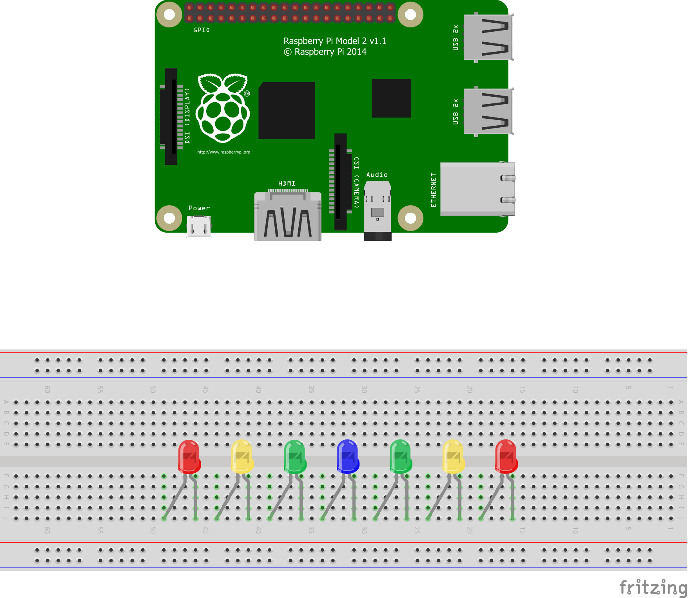
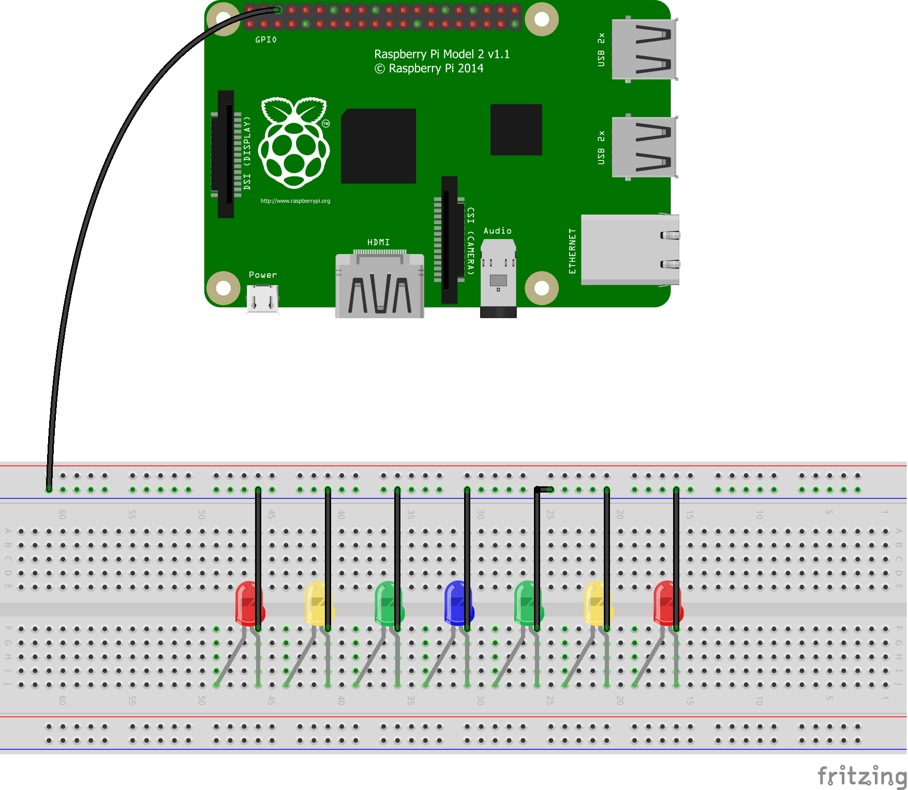
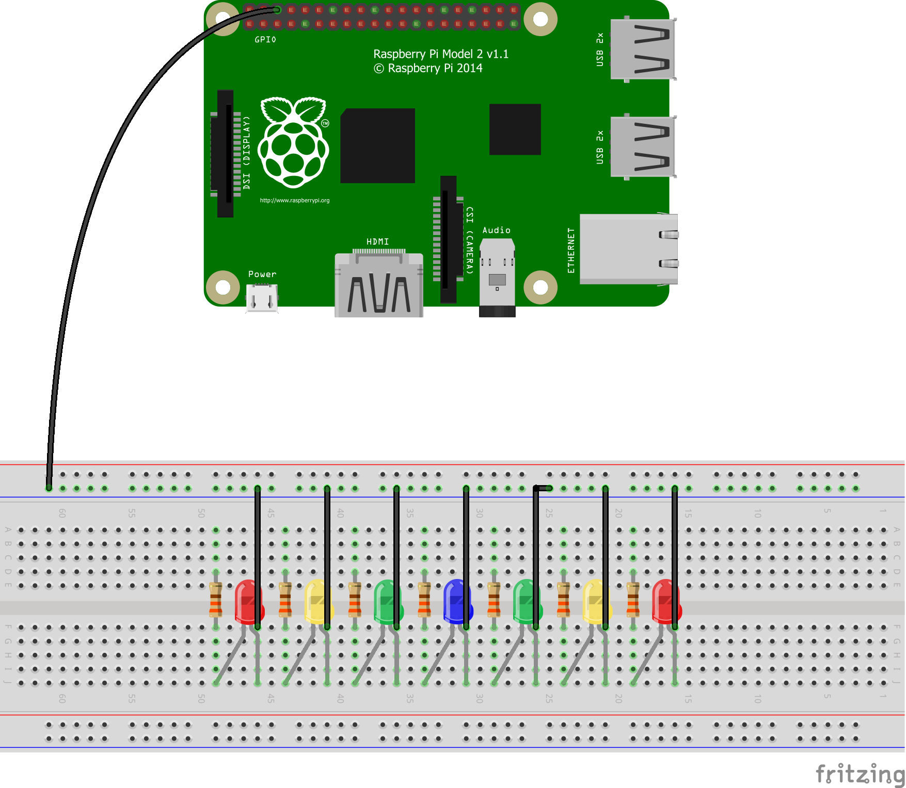
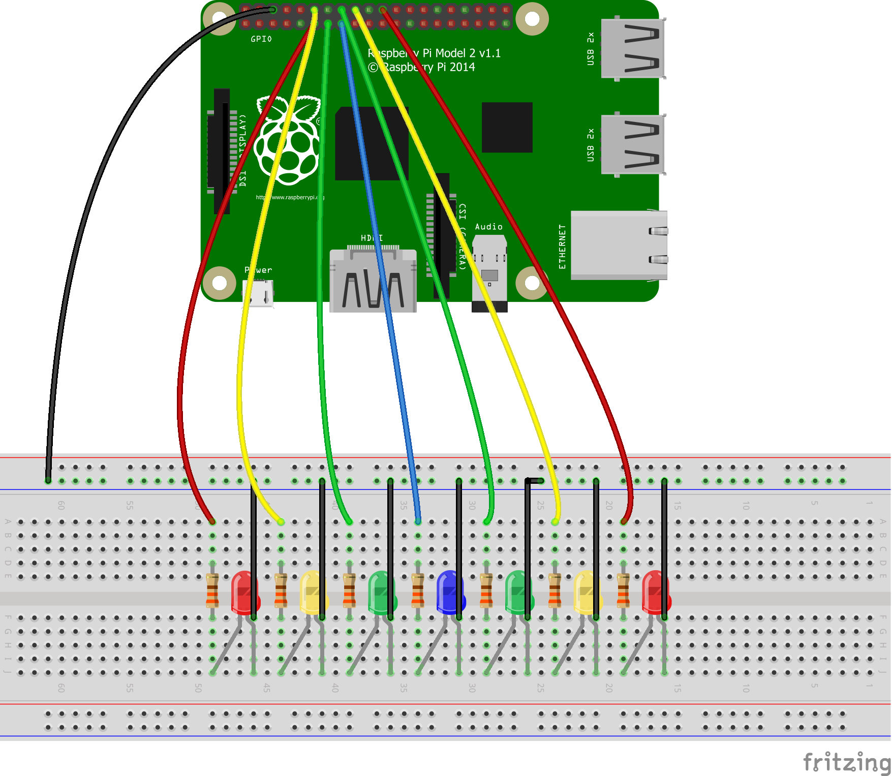
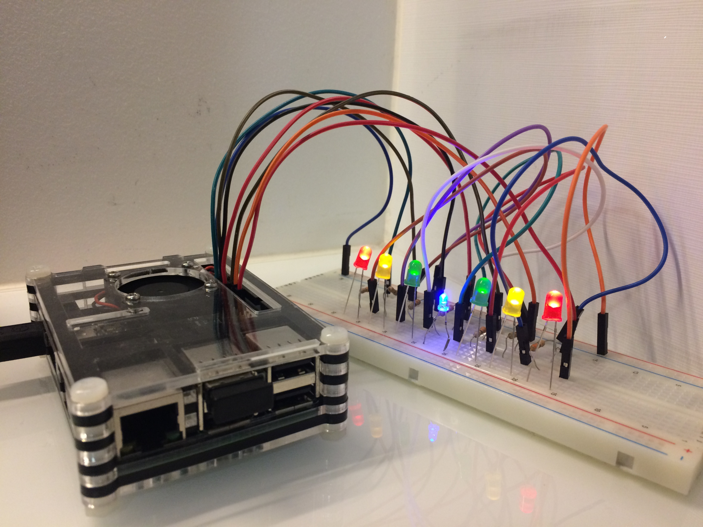

# Bop It! Pi
# [[en](#en)-[pt](#pt)]

## English

### Index
* [The game](#game)
* [What you will need](#materials)
* [How to build it](#building)
* [To-do](#to-do)

 

### The game
Bop It! Pi is a game made for the [Raspberry Pi](https://www.raspberrypi.org/), built on the [Processing Programming Language](https://processing.org/) and that makes use of the computer's [General Purpose Input and Output (GPIO)](https://en.wikipedia.org/wiki/General-purpose_input/output) pins. It was inspired by [Bop It! Smash](https://en.wikipedia.org/wiki/Bop_It#Bop-It!_Smash), a toy made by [Hasbro](https://en.wikipedia.org/wiki/Hasbro). The game consists on trying to get the greatest score you can without losing any life while doing it. The LEDs will flash like a ball bouncing from side to side. You need to press a key on your keyboard to catch it. The yellow and red LEDs make you lose a heart, while the blue LED (the one in the center) recovers one. The score you get for each catch also depends on the color of the LED where the "ball" stops on.

### What you will need: 
- A Raspberry Pi of any model (the one used in the tutorial will be the Raspberry Pi Model 2 v1.1)
- A double-sided breadboard*
- 2 red LEDs**
- 2 yellow LEDs**
- 2 green LEDs**
- 1 blue LED**
- 7 330ohm resistors
- 8 male to female jumper wires
- 7 male to male jumper wires
- The Processing code available [here](https://github.com/joogps/Bop-It-Pi/tree/master/Game)

__\*__ You can manage to build the circuit on a single-sided breadboard as well, but the explanation will be based on a double-sided one.  
__\*\*__ The LEDs don't need to necessarily be red, green, yellow and blue. The only thing that matters is wether not you arrange them properly. You can also edit the code to add more LEDs to the project, remove some of them if the ones you have aren't enough or maybe even edit their conections with the GPIO interface.

### How to build it:
_Circuit images made with [Fritzing](http://fritzing.org/home/)_

<table> 
	<tr> <td style="padding: 3%"> <b>1.</b> Simetrically place the LEDs on the bottom side of your breadboard with their anode legs (the short ones) to the right. </td> <td width="50%" height="auto" style="padding: 3%"><a href="Circuit/Step1.png"></img></a> </td> </tr>
	<tr style="background-color: white !important"> <td style="padding: 3%"> <b>2.</b> Using a male to female jumper wire, make a connection between any ground pin on your Raspberry Pi and the negative (blue) column on your breadboard. </td> <td width="50%" height="auto" style="padding: 3%"><a href="Circuit/Step2.png"></img></a> </td> </tr>
	<tr> <td style="padding: 3%"> <b>3.</b> Use male to male wires to connect the anode legs (the ones on the right) of the LEDs to the negative column of the breadboard. </td> <td width="50%" height="auto" style="padding: 3%"><a href="Circuit/Step3.png"></img></a> </td> </tr>
	<tr style="background-color: white !important"> <td style="padding: 3%"> <b>4.</b> Use all of the 7 resistors to connect the cathode legs (the ones on the left) of the LEDs to any hole on the line on top of the one where your LED cathode is connected to on your breadboard. </td> <td width="50%" height="auto" style="padding: 3%"><a href="Circuit/Step4.png"></img></a> </td> </tr>
	<tr> <td style="padding: 3%"> <b>5.</b> On the same lines, connect the resistors to your Raspberry Pi in the following order (go from the extreme left resistor to the extreme right one): 
		<ul>
			<li>GPIO17 (pin 11)</li>
			<li>GPIO18 (pin 12)</li>
			<li>GPIO27 (pin 13)</li>
			<li>GPIO22 (pin 15)</li>
			<li>GPIO23 (pin 16)</li>
			<li>GPIO24 (pin 18)</li>
			<li>GPIO25 (pin 22)</li>
		</ul> </td> <td width="50%" height="auto" style="padding: 3%"><a href="Circuit/Step5.png"></img></a> </td> </tr>
	<tr style="background-color: white !important"> <td style="padding: 3%"> <b>6.</b>  Once you have the Processing code on your computer, make sure you've <a href="https://pi.processing.org/download/">installed Processing for Pi</a> and run the files for the game itself. Alternatively, if you don't want to edit the code anytime soon, you can run the exported application available <a href="https://github.com/joogps/Bop-It-Pi/tree/master/Game/application.linux-armv6hf">here</a> without needing to install Processing itself. </td> <td width="50%" height="auto" style="padding: 3%"><a href="Circuit/Step6.png"></img></a> </td> </tr>
	<tr> <td style="padding: 3%"> <b>7.</b> It's done! Congratulations you did it! I hope you enjoy it! Feel free to <a href="https://github.com/joogps/Bop-It-Pi/issues/new">make a question</a> and to help me develop this project even more! </td> <td width="50%" height="auto" style="padding: 3%"><a href="Circuit/Step7.jpg"></img></a> </td> </tr>
</table>

### To-do
* Push button based controlling
* Life system
* Improved user interface
* Different and improved animations

## Português

### Índice
* [O jogo](#pt-game)
* [O que você vai precisar](#pt-materials)
* [Como montar](#pt-building)
* [Pendente](#pt-to-do)

### O jogo
Bop-It! Pi é um jogo feito para o [Raspberry Pi](https://www.raspberrypi.org/), programado em [Processing]() e que faz uso dos pinos [GPIO (General Purpose Input and Output)](https://pt.wikipedia.org/wiki/General_Purpose_Input/Output) do computador. Ele foi inpirado no [Bop It! Smash](https://en.wikipedia.org/wiki/Bop_It#Bop-It!_Smash), um brinquedo feito pela [Hasbro](https://pt.wikipedia.org/wiki/Hasbro). O jogo consiste em conseguir a melhor pontuação que você puder sem perder nenhuma vida. Os LEDs irão piscar como uma bola quicando de um lado para o outro. Você deve pressionar uma tecla em seu teclado para pegá-la. Os LEDs vermelhos e amarelos te fazem perder um coração, enquanto o LED azul (o do centro) te faz recuperar um (a não ser que você esteja com todos os 3). A pontuação que você consegue a cada rodada também depende do LED onde a "bola" para.

### O que você vai precisar:
- Um Raspberry Pi de qualquer modelo (o do tutorial será o Raspberry Pi Model 2 v1.1)
- Uma protoboard com dois lados*
- 2 LEDs vermelhos**
- 2 LEDs amarelos**
- 2 LEDs verdes**
- 1 LED azul**
- 7 resistores de 330ohm
- 8 cabos jumper macho/fêmea
- 7 cabos jumper macho/macho
- O código em Processing disponível [aqui](https://github.com/joogps/Bop-It-Pi/tree/master/Game)

__\*__ Você pode, sim, montar o circuito em uma placa com apenas um lado, mas a explicação será baseada em uma de dois.  
__\*\*__ Os LEDs não precisam, necessariamente, ser vermelhos, verdes, amarelos e azuis. A única coisa que importa é se você os organiza corretamente. Você ainda pode editar o código para adiconar mais LEDs, remvover alguns se você não tem o suficiente ou até talvez editar as suas conexões com a interface GPIO.

### Como montar:

<table> 
	<tr> <td style="padding: 3%"> <b>1.</b> Simetricamente posicionar os LEDs na parte inferior de sua protoboard com as 'pernas' de anodo (as mais curtas) em sua direita </td> <td width="50%" height="auto" style="padding: 3%"><a href="Circuit/Step1.png"></img></a> </td> </tr>
	<tr style="background-color: white !important"> <td style="padding: 3%"> <b>2.</b> Usando um cabo jumper macho/fêmea, faça uma conexão entre qualquer pino terra (GND) em seu Raspberry Pi e a coluna negativa (azul) na protoboard. </td> <td width="50%" height="auto" style="padding: 3%"><a href="Circuit/Step2.png"></img></a> </td> </tr>
	<tr> <td style="padding: 3%"> <b>3.</b> Use cabos macho/macho para conectar as 'pernas' de anodo (as da direita) dos LEDs com a coluna negativa de sue Protoboard. </td> <td width="50%" height="auto" style="padding: 3%"><a href="Circuit/Step3.png"></img></a> </td> </tr>
	<tr style="background-color: white !important"> <td style="padding: 3%"> <b>4.</b> Use todos os 7 resistores para conectar as pernas de catodo (as da direita) dos LEDs com algum buraco da linha acima da qual o catodo de seu LED está posicionado em sua protoboard. </td> <td width="50%" height="auto" style="padding: 3%"><a href="Circuit/Step4.png"></img></a> </td> </tr>
	<tr> <td style="padding: 3%"> <b>5.</b> Conecte os resistores ao seu Raspberry Pi nos seguintes pinos (vá do resistor da extrema esquerda para o da extrema direita): 
		<ul>
			<li>GPIO17 (pino 11)</li>
			<li>GPIO18 (pino 12)</li>
			<li>GPIO27 (pino 13)</li>
			<li>GPIO22 (pino 15)</li>
			<li>GPIO23 (pino 16)</li>
			<li>GPIO24 (pino 18)</li>
			<li>GPIO25 (pino 22)</li>
		</ul> </td> <td width="50%" height="auto" style="padding: 3%"><a href="Circuit/Step5.png"></img></a> </td> </tr>
	<tr style="background-color: white !important"> <td style="padding: 3%"> <b>6.</b> Assim que você tiver o código em Processing no seu computador, certfique-se de que você tem o <a href="https://pi.processing.org/download/">Processing for Pi instalado</a> e execute os arquivos do jogo. Caso você não queira editar o código provido pelo repositório posteriormente, você pode simplesmente executar a aplicação exportada disponível <a href="https://github.com/joogps/Bop-It-Pi/tree/master/Game/application.linux-armv6hf">aqui</a> sem ter que instalar o Processing em si. </td> <td width="50%" height="auto" style="padding: 3%"><a href="Circuit/Step6.png"></img></a> </td> </tr>
	<tr> <td style="padding: 3%"> <b>7.</b> Está pronto! Parabéns, você conseguiu! Espero que você aproveite muito! Sinta-se livre para <a href="https://github.com/joogps/Bop-It-Pi/issues/new">fazer perguntas ou reportar problemas</a> e me ajudar a desenvolver ainda mais esse projeto! </td> <td width="50%" height="auto" style="padding: 3%"><a href="Circuit/Step7.jpg"></img></a> </td> </tr>
</table>

### Pendente:
* Controle por botões push
* Sistema de vidas
* Melhor interface de usuário
* Animações diferentes e aprimoradas

## [Back to top / Voltar ao início](#page)

